  
  
  

<h2 align="center">Tech Stack</h2>

  
  
  
  
  
  
  
  
  
  
  
  
  
  
  
  
  
  
  
  
  
  

<h2 align="center">GitHub Stats</h2>
<table width="100%">
  <tr>
    <td width="50%" align="center">
      
    </td>
    <td width="50%" align="center">
      
    </td>
  </tr>
</table>

<!-- 

  <picture>
    <source media="(prefers-color-scheme: dark)" srcset="github-snake-dark.svg" />
    <source media="(prefers-color-scheme: light)" srcset="github-snake.svg" />
    
  </picture>

 -->

  <picture>
    <source media="(prefers-color-scheme: dark)" srcset="dist/defense-dark.svg">
    
  </picture>

